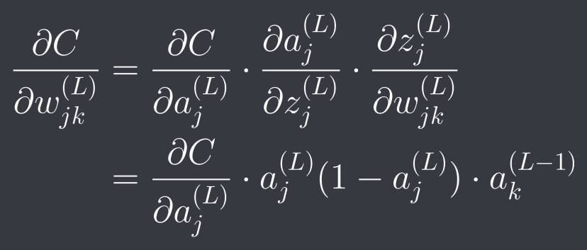
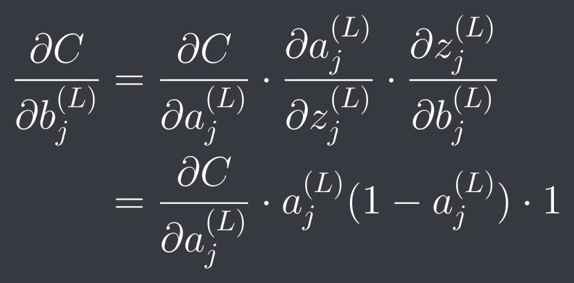
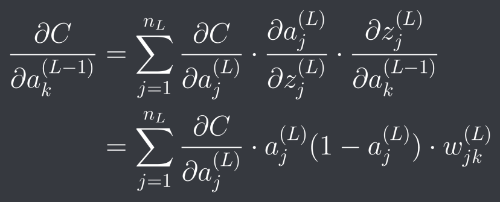

This is an implementation of a neural network to recognize handwritten decimal digits, made following [3Blue1Brown's playlist on YouTube](https://www.youtube.com/playlist?list=PLZHQObOWTQDNU6R1_67000Dx_ZCJB-3pi).

It uses the [MNIST Database](http://yann.lecun.com/exdb/mnist/) for the training and testing datasets. 
The images and labels have been parsed to a more convenient format:
 - The 60000 training images are stored in the form of a 60000 × 784 numpy array, each 784-length array representing the pixels of a 28 × 28 image.
 - The 10000 testing images are stored in a similar 10000 × 784 array.
 - The training and testing labels are stored in plain text files, having 60000 and 10000 newline separated labels respectively.

The formulae used in the backpropagation algorithm are:

1.

This gives us the partial derivative of the cost function with respect to the weight of the edge from the kth neuron in the previous layer to the jth neuron in the current layer.

2. 

This gives us the partial derivative of the cost function with respect to the bias on the jth neuron in the current layer.

3. 

This gives us the partial derivative of the cost function with respect to the activation of the kth neuron in the previous layer. This is needed for propagating the adjustments - so that the weights and biases of the previous layer can be updated.
